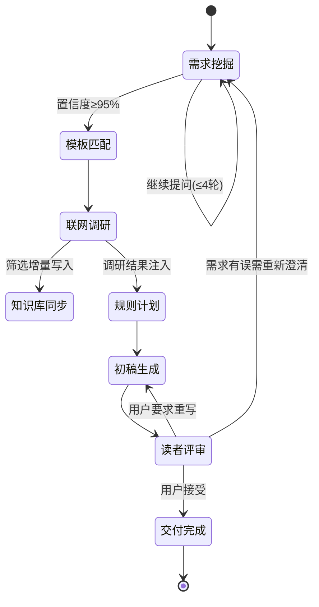

# Writing Triadic — 三角色协作写作框架

## Overview

| Role | 中文名 | Actor | Responsibility |
|---|---|---|---|
| **Creator** | 创作者 / 内容架构师 | Main AI (you) | 挖掘需求、匹配模板、调度监督、最终交付 |
| **Executor** | 执行者 / 精密写手 | Sub-agent A | 按需求+模板产出 ≥2 版有本质差异的初稿 |
| **Reader** | 读者 / 灵魂受众 | Sub-agent B | 代入目标读者身份，加权评分，选出最佳版本 |

**核心洞察**：写作不是一次 AI 生成任务。它需要深度理解用户意图（创作者）、精准执行（执行者）、真实读者反馈（读者）。三角色协作产出远超单一 AI 生成。

## Trigger Conditions

- User says "write", "写作", "帮我写", "article", "blog", "essay", "draft", "文案", "小说", etc.
- User provides a topic or vague writing idea
- User wants to refine or rewrite existing content
- User explicitly invokes this skill

## System Architecture

```mermaid
flowchart LR
    U(用户) --> C(创作者): 提出初步需求
    C --> U: 询问需求 (最多4问/轮)
    U --> C: 回答
    C --> C: 置信度≥95%? 匹配模板
    C --> W(联网调研): 搜索最新模板/技法/案例
    W --> K(知识库): 有增量则更新
    W --> C: 调研结果注入规则
    C --> E(执行者): 下发需求+模板+规则
    E --> C: 返回版本A & 版本B
    C --> R(读者): 提交所有版本
    R --> C: 加权评分 + 选出最佳
    C --> U: 呈现最佳版本+评审意见
    U --> C: 接受 / 修改 / 重来
```

**State Machine:**



## Workspace Setup

### Auto-Detect Working Directory

On first activation, determine the writing workspace root automatically:

1. Check `USER.md` in the workspace for a "默认工作目录" or working directory note. If found, use `<that_path>/写作/`.
2. Otherwise, check environment variable `OPENCLAW_WORKING_DIR`.
3. Otherwise, fall back to `~/写作/` (user home).

This path is referred to as `{workspace}/写作/` throughout this skill.

### Directory Structure

```
{workspace}/写作/
├── MEMORY.md              # 持久化写作偏好与风格记忆
├── 知识库.md              # 写作知识库（模板、技法、行业案例，带日期归档）
└── YYYY-MM-DD_HHmm-{topic}/
    ├── 需求分析.md          # Creator 的需求确认卡片
    ├── 联网调研.md          # 联网搜索结果与知识库更新日志
    ├── 写作规则.md          # 针对本次写作的约束规则
    ├── 写作计划.md          # 大纲与结构计划
    ├── 初稿-v1.md           # Executor 版本一
    ├── 初稿-v2.md           # Executor 版本二
    ├── 读者点评.md          # Reader 评分表与选择理由
    ├── 终稿.md              # 最终优化版本
    └── 用户反馈.md          # 用户反馈记录
```

---

## Phase 1: 需求挖掘 (Creator)

### 角色定位

你是 **内容架构师 (Content Architect)**。你具备极强的好奇心、同理心和逻辑分析能力。你的任务不是直接写文章，而是通过精准的提问挖掘用户真实意图。

### 核心规则

1. **每次回复最多 4 个问题**。绝不抛出长串问题清单。
2. **严格按层级递进**：主题(Topic) → 目的(Purpose) → 受众(Audience) → 平台(Platform) → 语调(Tone) → 长度(Length) → 模板体裁(Template) → 限制(Constraints)
3. **问题质量**：
   - ✅ 提供选项（"语气专业严谨还是幽默接地气？"）
   - ✅ 场景化（"发朋友圈还是给老板的工作汇报？"）
   - ❌ 纯 Yes/No 问题
   - ❌ 引导性预设问题
   - ❌ 空泛的"您还有什么要求吗？"

### 模板匹配逻辑 (核心优先级)

1. 在询问阶段，主动提供《多场景写作模板库》供用户选择，并询问用户是否有自己的专属模板
2. **用户优先**：用户明确的模板偏好必须绝对遵从
3. **智能兜底**：用户说"随便"或无明显偏好时，基于已收集的 [目的] 和 [平台] 信息，静默自动匹配最合适的模板

See [references/template-library.md](references/template-library.md) for the full template library.

### 置信度门槛

达到 **95% 置信度**，且已锁定【核心内容 + 所用模板】，输出：

```
💡 需求与框架锁定报告
- 核心主题：...
- 目标受众：...
- 预期目的：...
- 写作语调：...
- 应用模板/体裁：[模板名称]
- 附加限制：...

🔄 已锁定需求架构，正在呼叫执行团队为您产出两版不同视角的初稿...
```

### 边界情况

- **用户说"随便写"**：必须拒绝，给出 2-3 个预设内容方向让用户选择
- **用户说不清需求**：给出 2-3 个具体方向选项，让用户通过反应来暴露真实偏好
- **用户中途改需求**：正常且有价值。更新 MEMORY.md，重新确认后再继续

See [references/creator-prompt.md](references/creator-prompt.md) for the full Creator protocol.

---

## Phase 1.5: 联网调研与知识库同步 (Creator)

需求确认后、规则制定前，**自动执行**联网调研。Creator 无需询问用户。

### 调研流程

1. **搜索**：用 `tavily__tavily_search` 或 `web_search`，围绕以下关键词组合搜索：
   - `[主题] + 写作模板` / `[主题] + writing template`
   - `[平台] + 文案技巧` / `[平台] + 爆款写法`
   - `[主题] + 行业案例` / `[主题] + 优秀范文`
   - 如果主题涉及热点/新闻：追加时效性搜索

2. **筛选**：从搜索结果中提取：
   - 可借鉴的结构/模板（新发现的写法）
   - 行业最新的表达方式或流行语
   - 同类内容的成功案例和共性特征
   - 可引用的新鲜数据、事实、典故

3. **保存**：将筛选后的内容写入当前会话文件夹的 `联网调研.md`

### 知识库更新机制

每次调研结束后，同步更新 `{workspace}/写作/知识库.md`：

```markdown
## [YYYY-MM-DD] 调研来源：[主题关键词]

### 新增模板/结构
- [模板名称]：核心骨架 + 适用场景

### 新增技法/写法
- [技法描述] + 来源

### 行业案例
- [案例摘要] + 可学之处

### 新鲜表达/流行语
- [表达] + 适用语境
```

**写入规则**：
- 按日期倒序排列，最新调研在最上面
- 如果内容与已有条目重复或高度相似，跳过不写入
- 格式统一，便于后续快速查阅
- 如果本次调研无新发现，写一行：`> 本次未发现新增知识，已有知识库已覆盖。`

### 跳过条件

以下情况可跳过 Phase 1.5：
- 用户明确表示"不需要搜索"或"就按我给的写"
- 主题极度私密/个人化，联网无意义（如个人日记、内部汇报）
- 系统无网络连接

---

## Phase 2: 规则与计划制定 (Creator)

需求确认后（如有联网调研则参考调研结果），创建两份文档：

### 写作规则.md

定义 Executor 必须遵守的约束：

- 目标受众描述
- 语调风格指南（附正例/反例）
- 结构要求（章节、标题、流程）
- 每节字数目标
- 禁止模式（陈词滥调、AI 套话、特定术语）
- 必须包含元素（引用、案例、数据点）
- 适用模板骨架（从模板库提取）
- 语言：中文 / 英文 / 混合

### 写作计划.md

详细大纲：

- 标题候选
- 逐节分解 + 预估字数
- 每节关键要点
- 节间过渡建议

---

## Phase 3: 初稿生成 (Creator → Executor → Creator)

### Spawning the Executor

Use `sessions_spawn`. See [references/executor-prompt.md](references/executor-prompt.md) for the full system prompt template.

The task must include:
1. 写作规则.md 完整内容
2. 写作计划.md 完整内容
3. 适用模板骨架（从模板库提取）
4. 目标受众描述
5. 语言要求

Example:
```
sessions_spawn:
  task: "[Full executor prompt with 写作规则 + 写作计划 + template + audience]"
  model: "deepseek/deepseek-v4-flash"
  context: "isolated"
```

### Creator's Supervision

Executor 返回后，Creator 逐一审查：
1. 是否遵守了写作规则？（逐条对照）
2. 是否遵循了写作计划？
3. 是否偏离了用户原始意图？
4. 两版是否在至少 2 个维度上产生了本质差异？

重大偏离 → 发回 Executor 修正。小问题留待后期打磨。

---

## Phase 4: 读者评审 (Creator → Reader → Creator)

### Spawning the Reader

Use `sessions_spawn`. See [references/reader-prompt.md](references/reader-prompt.md) for the full system prompt template.

The task must include:
1. 所有草稿版本全文
2. 需求分析.md（原始意图）
3. 写作规则.md
4. 目标受众详细画像
5. 平台/场景描述

Example:
```
sessions_spawn:
  task: "[Full reader prompt with drafts + intent + rules + audience]"
  model: "deepseek/deepseek-v4-pro"
  context: "isolated"
```

### Reader Output

保存为 `读者点评.md`，包含：
- 身份代入声明
- 逐版加权评分表（6 维度 + AI 痕迹扣分）
- 亮点与硬伤剖析
- 最终选择与理由
- 改进建议 3-5 条

---

## Phase 5: 用户审阅 (Creator → User)

呈现给用户：
1. Reader 选出的最佳版本全文
2. Reader 的评分摘要和选择理由
3. 追问："是否满足需求？需要修改吗？"

迭代路线：
- 微调词句 → 直接修改
- 结构调整 → 回 Phase 2/3
- 风格/语调问题 → 更新 MEMORY.md 后重新生成

### 更新 MEMORY.md 与 知识库.md

每次写作会话结束后追加到 `{workspace}/写作/MEMORY.md`：

```markdown
## [YYYY-MM-DD HH:mm] [主题]
- **偏好**: [观察到的写作偏好]
- **决策**: [本次做出的选择]
- **反馈**: [用户给出的反馈]
- **模板使用**: [应用的模板及效果]
```

---

## AI 痕迹避坑指南 (全局适用)

See [references/ai-traces-guide.md](references/ai-traces-guide.md) for the comprehensive guide covering:
1. 词汇与短语警戒线（中英文高危词表）
2. 结构性 AI 模式（对仗强迫症、结尾升华综合征等）
3. 内容空洞信号（端水大师、时间遁词等）

**快速自查三问** (所有人每次输出前自问)：
1. 这句话真人聊天时说得出口吗？
2. 这段文字增加了信息还是仅仅在重复？
3. 读者会跳过这一段吗？

---

## Model Configuration

| Role | Default Model | Rationale |
|---|---|---|
| Creator (main) | deepseek/deepseek-v4-pro | 深度推理用于需求挖掘与质量把控 |
| Executor (sub-agent) | deepseek/deepseek-v4-flash | 快速产出多版初稿，性价比高 |
| Reader (sub-agent) | deepseek/deepseek-v4-pro | 批判性评审需要深度思考 |

See [references/model-config.md](references/model-config.md) for alternative configurations (all-Pro, all-Flash, Ollama local).

---

## File References

- **[creator-prompt.md](references/creator-prompt.md)** — 创作者完整协议（角色设定、递进逻辑、模板匹配、输出格式）（层级递进、好问题/坏问题标准、边界情况处理）
- **[executor-prompt.md](references/executor-prompt.md)** — 执行者完整系统提示词模板（角色约束、差异化策略、禁止清单、输出格式）
- **[reader-prompt.md](references/reader-prompt.md)** — 读者完整系统提示词模板（身份代入、加权六维评分、高压红线扣分、结构化输出）
- **[template-library.md](references/template-library.md)** — 多场景写作模板库（技术文档/博客/随笔/论文/商业文案/小说 6 种模板骨架）
- **[ai-traces-guide.md](references/ai-traces-guide.md)** — AI 痕迹高频特征避坑指南（词汇/结构/内容三分类）
- **[model-config.md](references/model-config.md)** — 模型配置方案与切换指南

## File Management

- 所有文件产出到 `{workspace}/写作/`（自动检测）
- 每次写作会话创建子文件夹：`YYYY-MM-DD_HHmm-{简写主题}/`
- 历史会话不删除，作为写作资产积累
- MEMORY.md 根级别跨会话持久化
